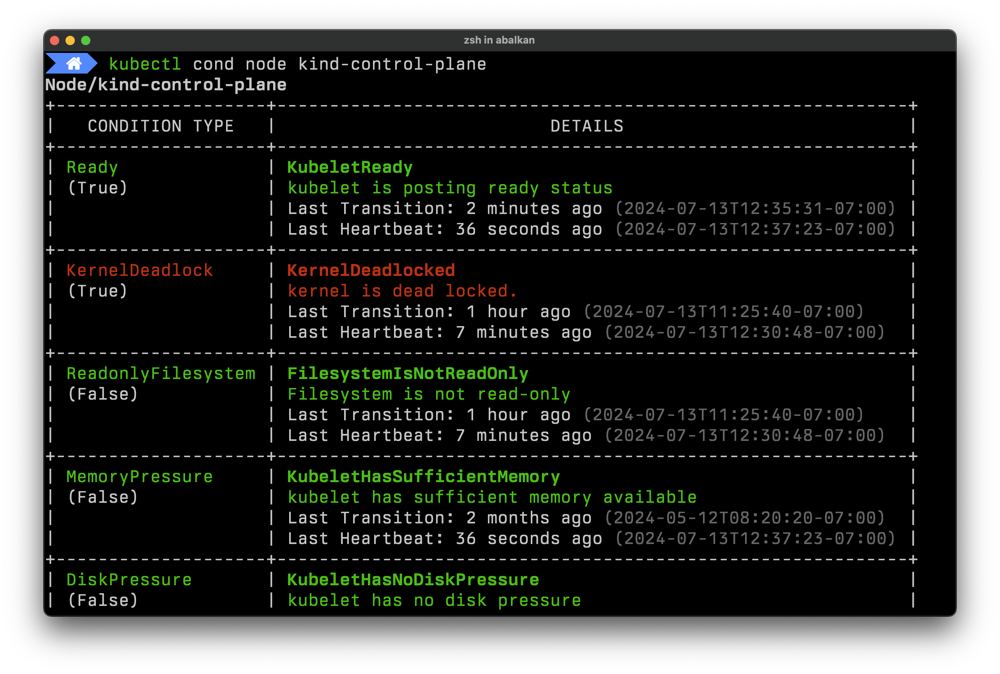

# kubectl cond

A kubectl plugin to print Kubernetes object resource conditions in
a more human-readable format.

## Usage

You can specify `kubectl cond` like `kubectl get` to query the conditions of a
specific object by resource kind, name, namespace, list by category, or by file:

```text
kubectl cond <object-type> <object-name>
kubectl cond nodes
kubectl cond -f <manifest.yaml>
kubectl cond all -n <namespace>
```

## Example



## Installation

Install this plugin using [Krew](https://krew.sigs.k8s.io/).

```shell
kubectl krew install cond
```

Or, download the binary from the **Releases** page and move it somewhere on your
`PATH`.

## License

This project is distributed under [Apache 2.0 License](./LICENSE).
